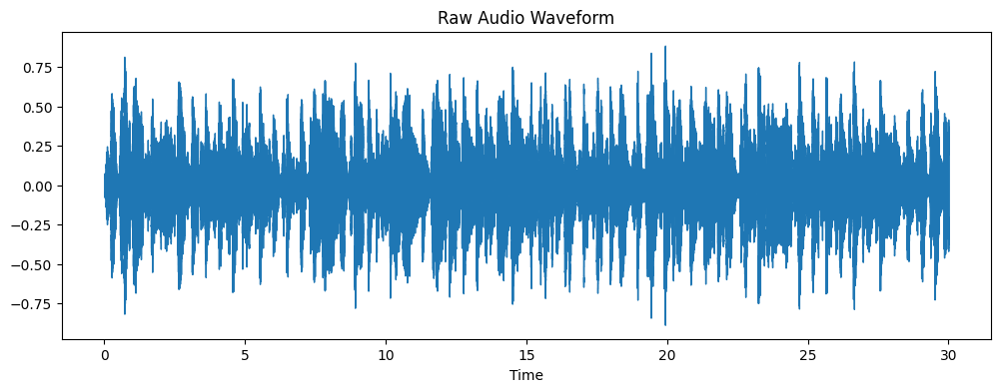
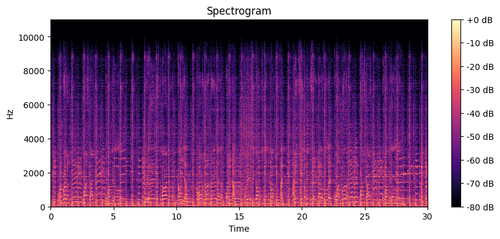

# Using Fourier Transforms to Classify Music Genres

*Coursework for Math 104 (Applied Matrix Theory), Winter 2025. Written during first year at Stanford.*

Classifies 30-second audio clips into 10 musical genres using Short-Time Fourier
Transform (STFT) spectrograms and derived audio features, with an XGBoost classifier.
The goal was to work through the linear algebra behind the Fourier transform on real
signals, not to beat published benchmarks.

**Result: 64% test accuracy across 10 genres** (chance = 10%), up from 56% with an
initial RandomForest baseline.

## Approach

| Stage | What it does |
|---|---|
| Preprocessing | Standardize every `.wav` to 22.05 kHz mono via `librosa` |
| Transform | STFT → magnitude spectrogram in dB |
| Features | Time-averaged spectrogram + 13 MFCCs, spectral centroid, zero-crossing rate, spectral bandwidth, spectral rolloff, 12 chroma bins, tempo |
| Balancing | SMOTE on the training split |
| Reduction | PCA retaining 95% of variance |
| Model | XGBoost, tuned with 5-fold `GridSearchCV` |

The scaler, SMOTE, and PCA are all fit on the training split only and applied to the
test split with `.transform()`, so no test information leaks into training.




## Running it

```bash
pip install numpy matplotlib librosa scikit-learn pandas imbalanced-learn xgboost
jupyter notebook notebook.ipynb
```

The audio is not in this repo (~1.2 GB). Download the
[GTZAN dataset](https://www.kaggle.com/datasets/andradaolteanu/gtzan-dataset-music-genre-classification)
from Kaggle and extract it so the layout is:

```
data/genres_original/{blues,classical,country,disco,hiphop,jazz,metal,pop,reggae,rock}/
```

Feature extraction over all 1,000 tracks takes roughly 6 minutes. One file
(`jazz/jazz.00054.wav`) is corrupt in the original dataset and is skipped automatically.

## What I'd do differently

Writing this up afterward, three things stand out:

- **The feature vector is dominated by the raw spectrogram.** `np.mean(spectrogram, axis=1)`
  contributes 1,025 dimensions; every hand-picked feature I spend most of the report
  motivating adds up to 30. The MFCCs and spectral centroid are ~3% of the input, which
  likely explains why accuracy sits below the ~70–80% that classic-feature GTZAN
  baselines reach. Dropping the averaged spectrogram and keeping the engineered
  features is the first experiment I'd run.
- **SMOTE wasn't needed.** GTZAN is balanced by construction — 100 tracks per genre, and
  my run skipped exactly one file. Oversampling a 100/…/99 split is effectively a no-op,
  so the accuracy gain from RandomForest to XGBoost can't be attributed to better
  handling of class imbalance.
- **A confusion matrix and real feature importances** would say much more than a single
  accuracy number, especially for genres that plausibly blend (rock/metal, disco/pop).

An SVM with an RBF kernel, or a small CNN over the spectrograms treated as images, is
the better-suited approach for this data and would be the natural follow-up.

## Files

- `notebook.ipynb` — full pipeline, from audio loading to evaluation
- `report.pdf` — the written report, covering the Fourier basis, STFT/DFT, and the derivation of each feature
- `figures/` — generated plots
